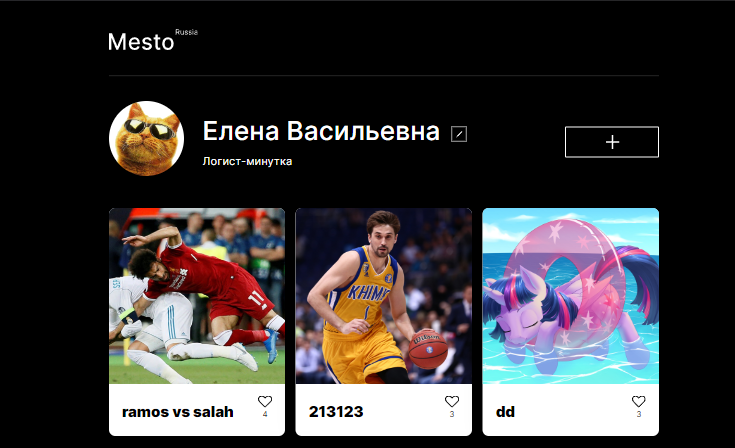

# Проект: Место

## О проекте:

Проектная работа на Яндекс. Практикум, написанная на React
Проект является интерактивной страницей, куда можно добавлять фотографии, удалять их и ставить лайки, добавлена возможность регистрации и авторизации пользователей

  

## Посмотреть проект:
Клонируйте репозиторий на свой локальный компьютер. Затем установите зависимости с помощью:

### npm run start
чтобы запустить его в рабочем режиме.

### npm run dev
чтобы запустить его в режиме разработчика.

## Используемые технологии:

* Верстка на гридах и флексах;
* Адаптивный дизайн с помощью медиа-запросов;
* Плавность преходов открытия и закрытия модальных окон с помощью Transition;
* Масштабирование изображений при изменении разрешения страницы;
* Подключение проекта к серверу через Api;
* Регистрация и авторизация пользователей;
* Добавление новых фотографий, их удаление, лайки;
* Редактирование профиля

### Стек:
- HTML
- CSS
- JS
- React

&nbsp;
&nbsp;
&nbsp;
&nbsp;
